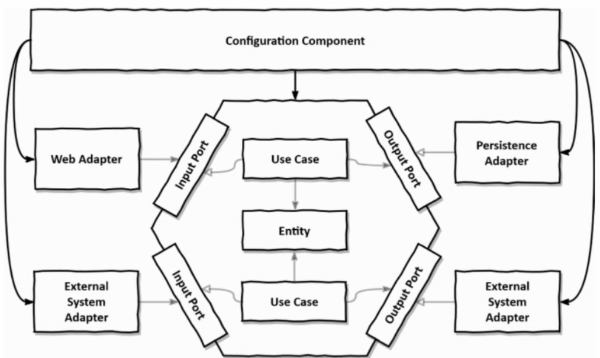

### CASO DE USO 1: mostrar listado de productos (JSON)

Llega una petición HTTP desde Postman o cualquier otro cliente por medio de un adaptador REST.

1. ProductRestController (ADAPTADOR DE ENTRADA: adaptador web)
2. ProductReadInPort (interfaz)

3. Product: Objeto de dominio
4. ProductReadUseCase (implementación del puerto de entrada)

5. ProductReadOutPort (interfaz)
6. ProductDAO (ADAPTADOR DE SALIDA: adaptador de persistencia)

### CASO DE USO 2: registrar productos

1. ProductController (ADAPTADOR DE ENTRADA: adaptador web)
2. ProductWriteInPort (interfaz)

3. Product: Objeto de dominio
4. ProductWriteUseCase (implementación del puerto de entrada)

5. ProductWriteOutPort (interfaz)
6. ProductDAO (ADAPTADOR DE SALIDA: adaptador de persistencia)

### CASO DE USO 3: mostrar listado de productos (HTML)

1. ProductWebController
2. ProductReadInPort (interfaz)

3. Product: Objeto de dominio
4. ProductReadUseCase (implementación del puerto de entrada)

5. ProductReadOutPort (interfaz)
6. ProductDAO (ADAPTADOR DE SALIDA: adaptador de persistencia)

### CASO DE USO 4: tarea programada para generar reporte de stock

1. SalesReportJob 
2. StockReportInPort

3. Product
4. ProductReadUseCase
5. StockReportUseCase

6. StockReportOutPort
7. CSVPersistence

### CASO DE USO 5: enviar un correo a un usuario

### Posibles casos de uso:

* Adaptador de entrada que devuelva un HTML de productos
* Registrar un nuevo usuario cliente (adaptador in /auth/register)
* Iniciar sesión (usuario cliente)
* Añadir un producto a un carrito
* Finalizar compra de un carrito 
* Realizar pago (utiliza adaptador de pago, ej: paypal)
* Calcular costes
  * En base al coste de todos los productos en stock
  * En base a los empleados
  * En base al coste de cada tienda
  * ...
* Calcular beneficios
  * En base a Tiempo
  * En base a categoría de producto
  * En base a tienda 
  * En base a empleado 
  * En base a donde reside customer

